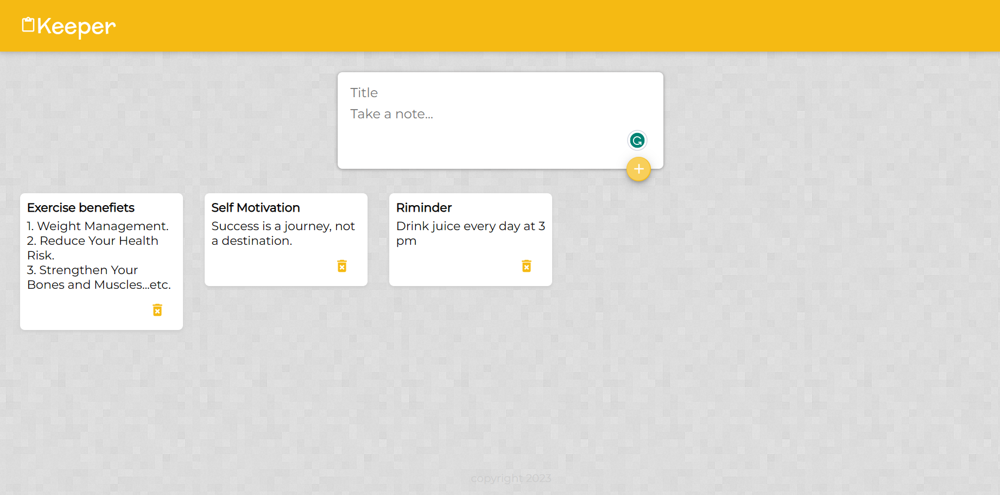
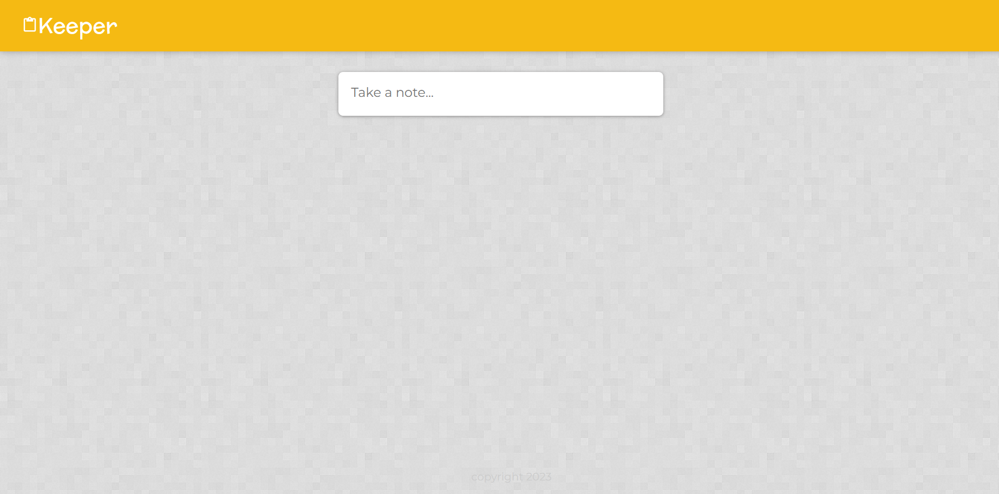
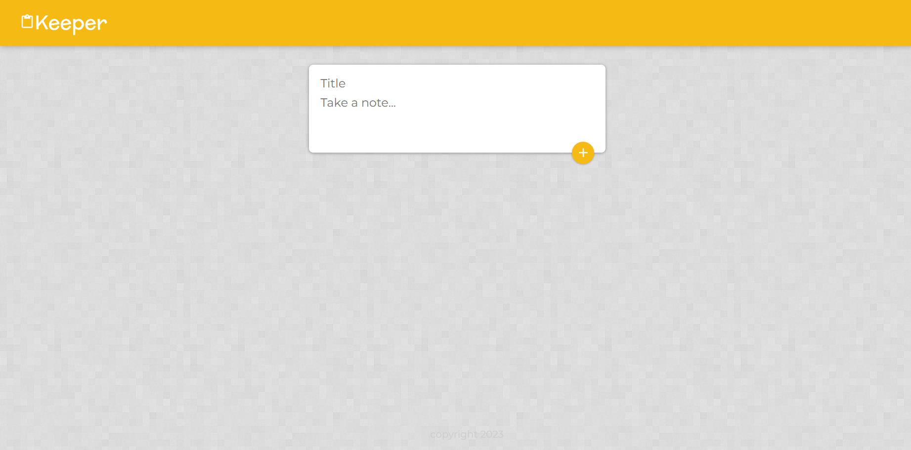

# Keeper-App in React

This is a React project its a simple app for adding notes. In this, you can add or delete the notes with animation and other stuff.

## Table of contents

-   [Overview](#overview)
    -   [The Theme](#the-theme)
    -   [Screenshot](#screenshot)
    -   [Links](#links)
-   [My process](#my-process)
    -   [Built with](#built-with)
    -   [What I learned](#what-i-learned)
    -   [Useful resources](#useful-resources)
-   [Author](#author)

## Overview

### The Theme

Users should be able to:

-   Add note title and add content.
-   Delete a particular note at any time.

### Screenshot

| Main Page                                                       |
| --------------------------------------------------------------- |
|  |

| Starting State of the page                                                 | Clicked State of the page                                                           |
| -------------------------------------------------------------------------- | ----------------------------------------------------------------------------------- |
|  |  |

### Links

-   [Github Solution](https://github.com/ShivamManiMaurya/Keeper_App)
-   [Live Site](https://shivammanimaurya.github.io/Keeper_App/)

## My process

### Built with

-   HTML5
-   CSS custom properties
-   JavaScript
-   [React](https://reactjs.org/) - JS library

### What I learned

-   Filter function
-   Pre-state functionality
-   Get more familiar with the useState hook
-   Introduction to Material UI

### Useful resources

-   [Akshay Saini](https://www.youtube.com/@akshaymarch7) - Akshay Saini bhaiya helped me in understanding javascript concepts

## Author

-   Website - [Shivam Maurya](https://shivammanimaurya.github.io/my_portfolio_website/)
-   GitHub Page - [Shivam Maurya GitHub](https://github.com/ShivamManiMaurya)
-   Linkedin - [@shivammanimaurya](https://www.linkedin.com/in/shivammanimaurya)
